# InfluenSync (Syncfluence) MVP

## 소개

InfluenSync(Syncfluence)는 브랜드와 인플루언서를 AI 기반으로 매칭하는 플랫폼입니다. 이 서비스는 브랜드가 마케팅 캠페인에 적합한 인플루언서를 찾고, 인플루언서가 자신의 콘텐츠 스타일과 맞는 브랜드 캠페인을 발견할 수 있도록 도와줍니다.

## MVP 버전 (0.1)

이 MVP는 핵심 기능에 중점을 둔 최소 기능 제품으로, 실제 데이터 대신 목업(Mock) 데이터를 활용하여 사용자 플로우를 검증하는 것이 목적입니다.

### 핵심 기능

#### 브랜드 사용자

- **회원가입 및 로그인**: 브랜드 계정으로 가입하고 로그인 (`/signup`, `/login`)
- **대시보드**: 생성한 캠페인 및 매칭된 인플루언서 목록 확인 (`/brand/dashboard`)
- **캠페인 생성**: 간단한 캠페인 정보 입력(이름, 타겟 플랫폼, 설명, 예산 범위) (`/brand/campaigns/create`)
- **캠페인 상세**: 특정 캠페인의 상세 정보 확인 (`/brand/campaigns/{campaignId}`)
- **인플루언서 프로필 조회**: 매칭된 인플루언서의 상세 정보 확인 (`/influencers/{influencerId}`)
- **AI 추천 인플루언서**: 각 캠페인에 적합한 인플루언서 추천 목록 확인 (`/brand/dashboard`에서 확인 가능)

#### 인플루언서 사용자

- **회원가입 및 로그인**: 인플루언서 계정으로 가입하고 로그인 (`/signup`, `/login`)
- **대시보드**: 프로필 정보, 매칭된 캠페인 요약 확인 (`/influencer/dashboard`)
- **캠페인 탐색**: 자신의 플랫폼과 콘텐츠 스타일에 맞는 캠페인 목록 확인 (`/influencer/dashboard`에서 확인 가능)
- **캠페인 상세**: 특정 캠페인의 상세 정보 확인 (`/influencer/campaigns/{campaignId}`)
- **AI 추천 브랜드**: 자신과 높은 적합성 점수를 가진 브랜드 및 캠페인 추천 확인 (`/influencer/dashboard`에서 확인 가능)
- **프로필 관리**: 기본 프로필 정보 설정 및 수정 (`/profile`)

### 주요 페이지 구성

1. **랜딩 페이지** (`/`)

   - 서비스 핵심 컨셉 및 가치 소개
   - 회원가입/로그인 버튼
   - 주요 기능 설명

   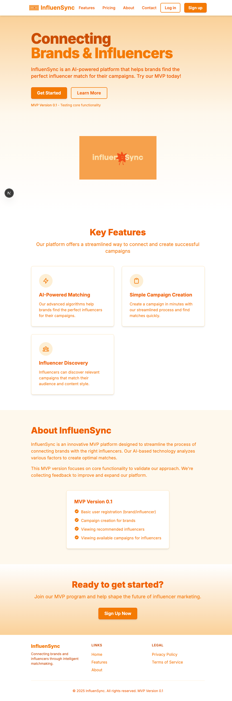

2. **회원가입/로그인** (`/signup`, `/login`)

   - 브랜드/인플루언서 역할 선택
   - 기본 정보 입력 및 인증

   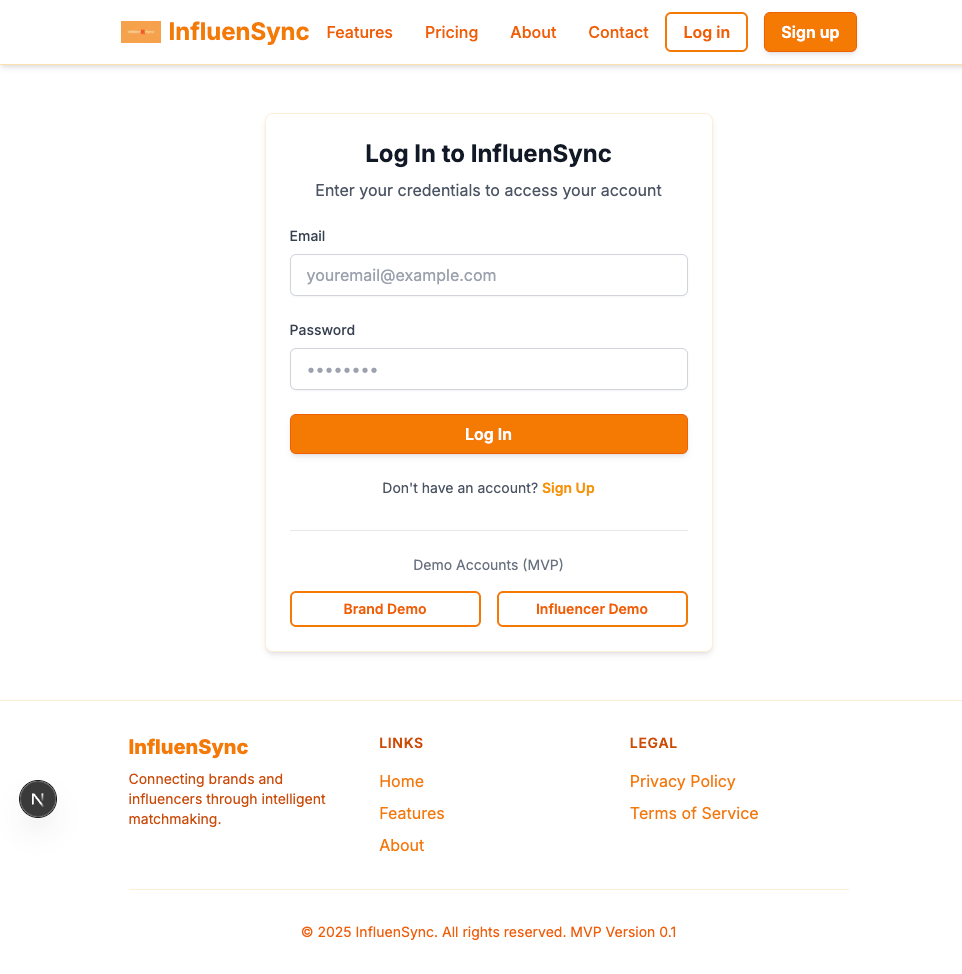

3. **브랜드 대시보드** (`/brand/dashboard`)

   - 캠페인 통계 요약 (총 캠페인 수, 활성 캠페인, 매칭된 인플루언서)
   - 생성한 캠페인 목록
   - 최근 매칭된 인플루언서 미리보기

   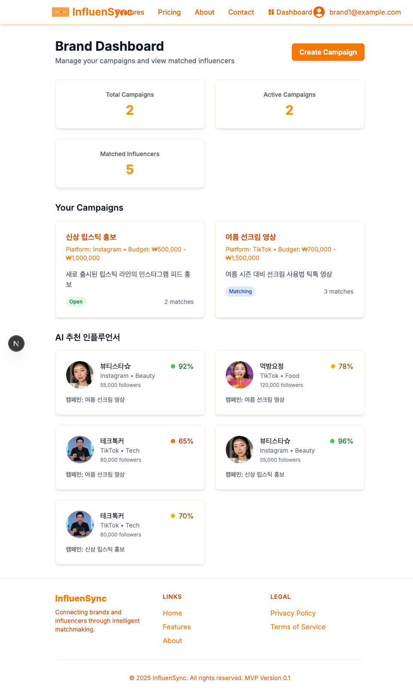

4. **캠페인 생성** (`/brand/campaigns/create`)

   - 캠페인 정보 입력 폼
   - 타겟 플랫폼 선택 (인스타그램, 틱톡 등)
   - 예산 범위 설정

   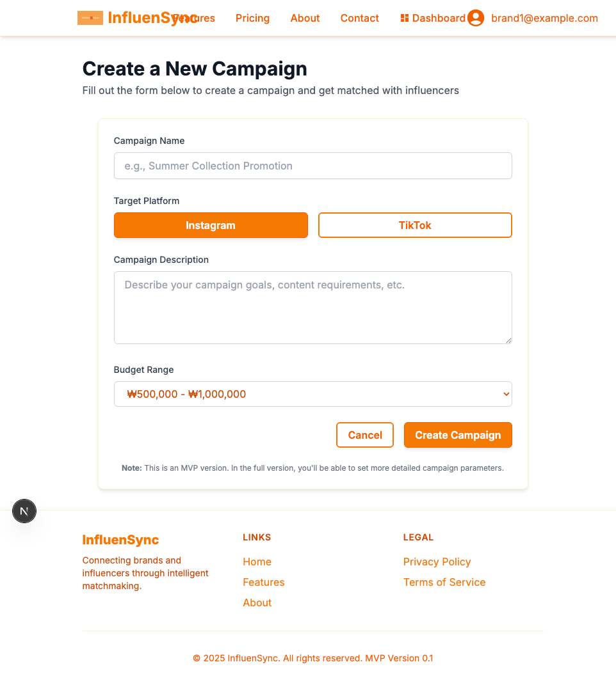

5. **브랜드 캠페인 상세** (`/brand/campaigns/{campaignId}`)

   - 캠페인 세부 정보
   - 매칭된 인플루언서 목록
   - 캠페인 상태 및 통계

   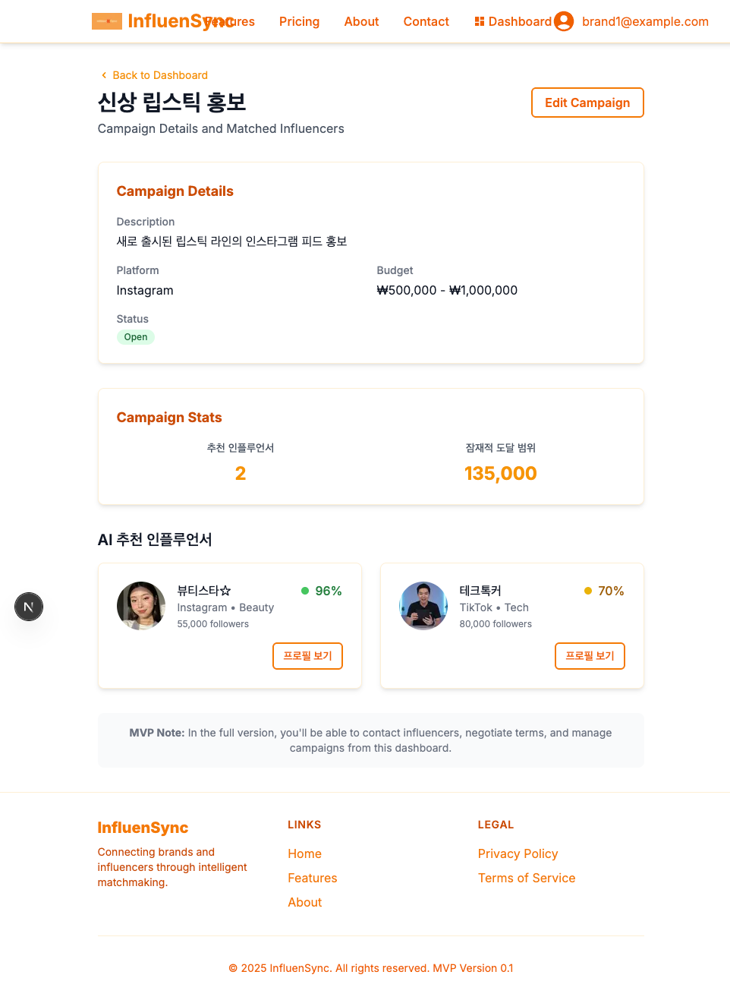

6. **인플루언서 대시보드** (`/influencer/dashboard`)

   - 프로필 요약 정보
   - 매칭된 캠페인 통계
   - AI 추천 브랜드 목록
   - 참여 가능한 캠페인 탐색

   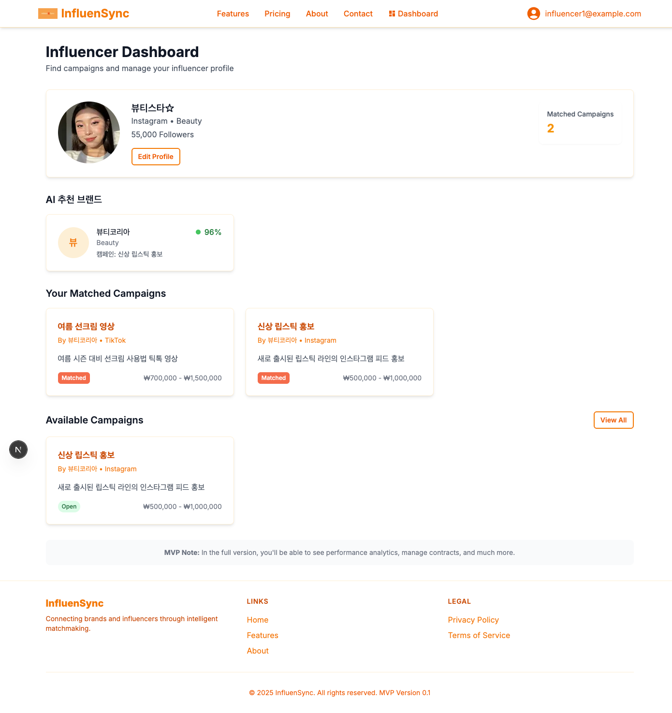

7. **인플루언서 캠페인 상세** (`/influencer/campaigns/{campaignId}`)

   - 캠페인 세부 정보
   - 브랜드 정보
   - 예산 범위 및 타겟 플랫폼
   - 지원하기 옵션

   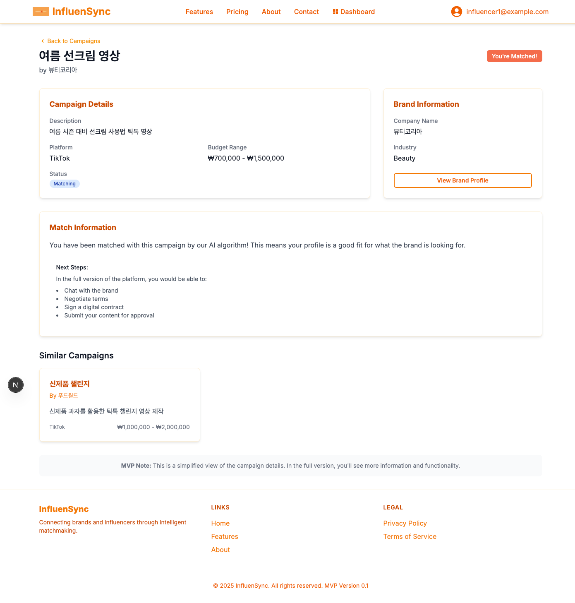

8. **인플루언서 프로필** (`/influencers/{influencerId}`)

   - 인플루언서 기본 정보
   - 팔로워 수 및 주요 활동 플랫폼
   - 샘플 콘텐츠 이미지
   - 적합성 점수 및 추천 이유

   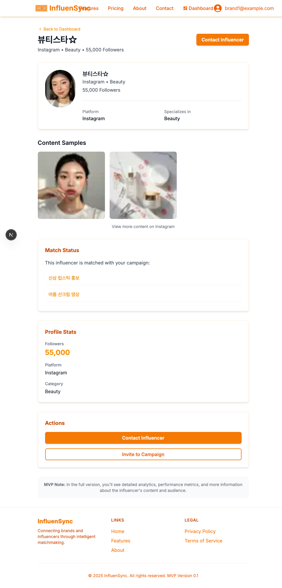

9. **채팅 기능** (`/influencers/{influencerId}/chat`)

   - 브랜드와 인플루언서 간 채팅
   - 협업 내용 논의

   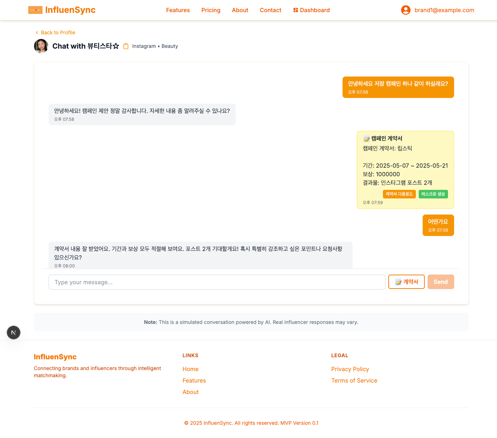

10. **계약 관리** (`/influencers/{influencerId}/chat/contract`)

    - 계약서 확인 및 승인
    - 계약 조건 협의

    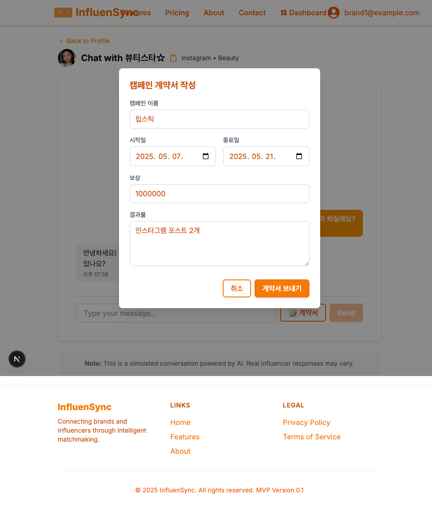

11. **에스크로 관리** (`/influencers/{influencerId}/chat/escrow`)

    - 에스크로 서비스 설정
    - 안전한 결제 관리

    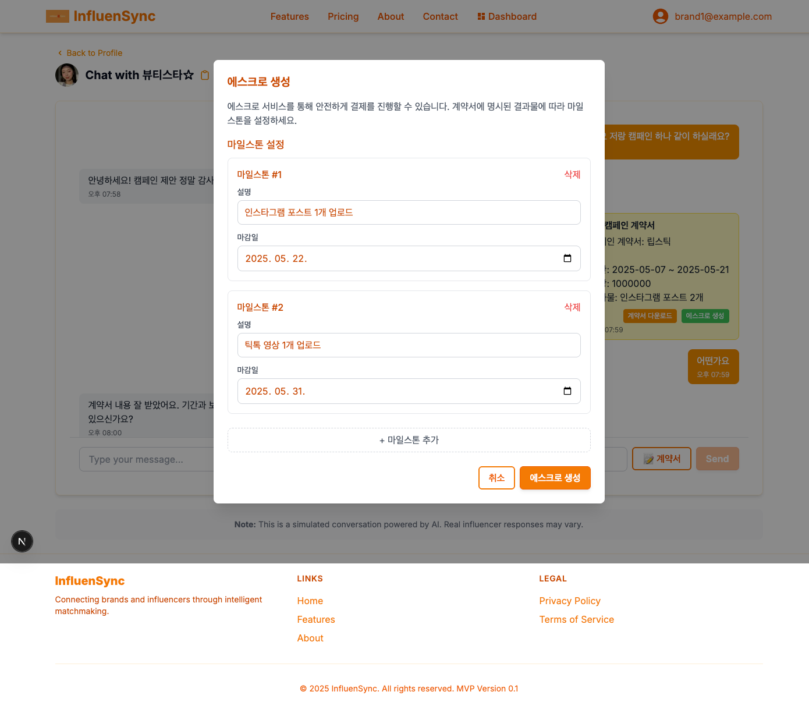

12. **에스크로 진행 상황** (`/influencers/{influencerId}/chat/escrow/progress`)

    - 마일스톤 확인
    - 결제 진행 현황

    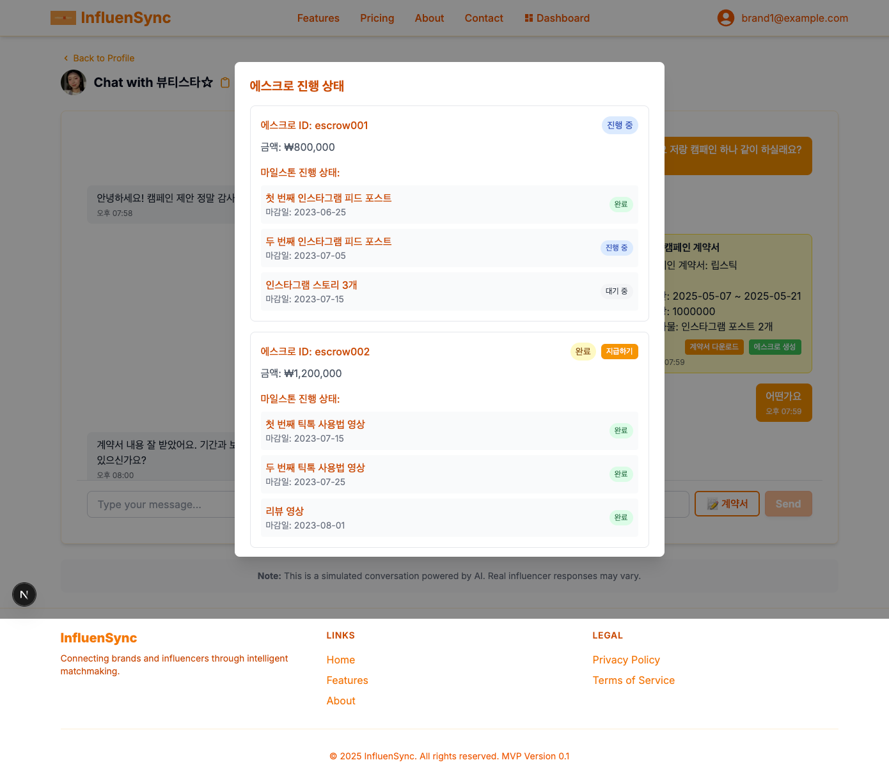

13. **프로필 관리** (`/profile`)

    - 사용자 프로필 정보 설정
    - 브랜드/인플루언서 상세 정보 입력
    - 프로필 이미지 및 콘텐츠 샘플 업로드 (인플루언서)

    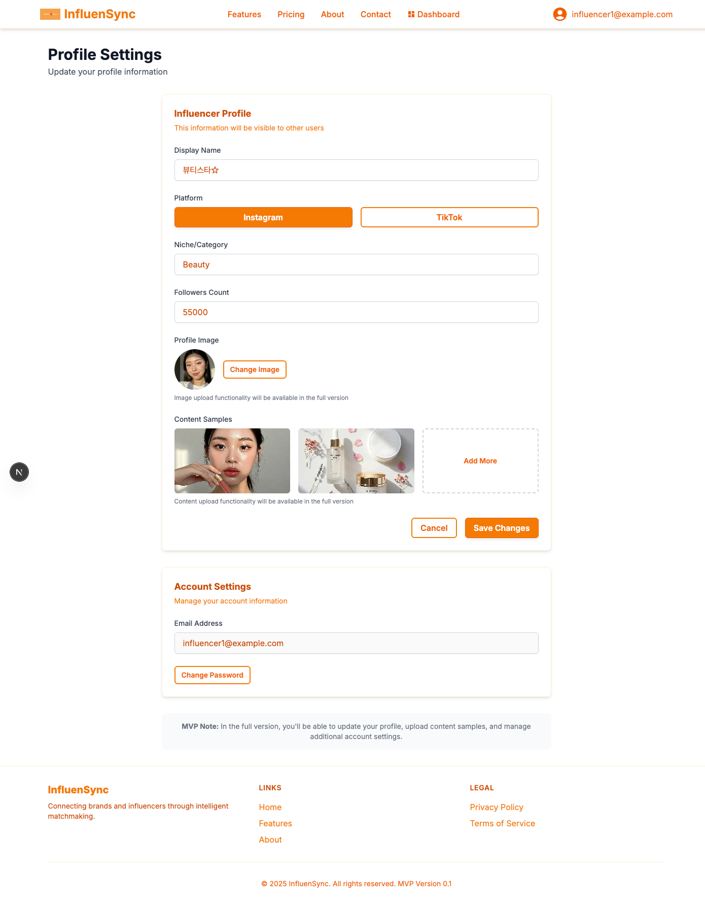

### 기술 스택

- **프론트엔드**: Next.js, React, TypeScript, Tailwind CSS
- **상태 관리**: 로컬 스토리지 및 클라이언트 사이드 상태 관리
- **데이터**: 목업(Mock) 데이터 활용

## MVP 범위 제외 사항

이 MVP는 다음 기능을 포함하지 않습니다(향후 개발 예정):

- 실제 AI 매칭 알고리즘 (현재는 Mock 데이터로 대체)
- 실제 계약 및 결제 기능
- 상세 성과 분석 및 리포팅
- 이커머스 연동
- 실시간 메시징 기능
- 복잡한 필터링 및 검색 기능
- 관리자 기능
- 외부 API 연동 (SNS 데이터 실시간 연동 등)

## 피드백 수집

이 MVP는 핵심 사용자 플로우를 검증하기 위한 목적으로 개발되었으며, 사용자 피드백을 통해 지속적으로 개선될 예정입니다.
